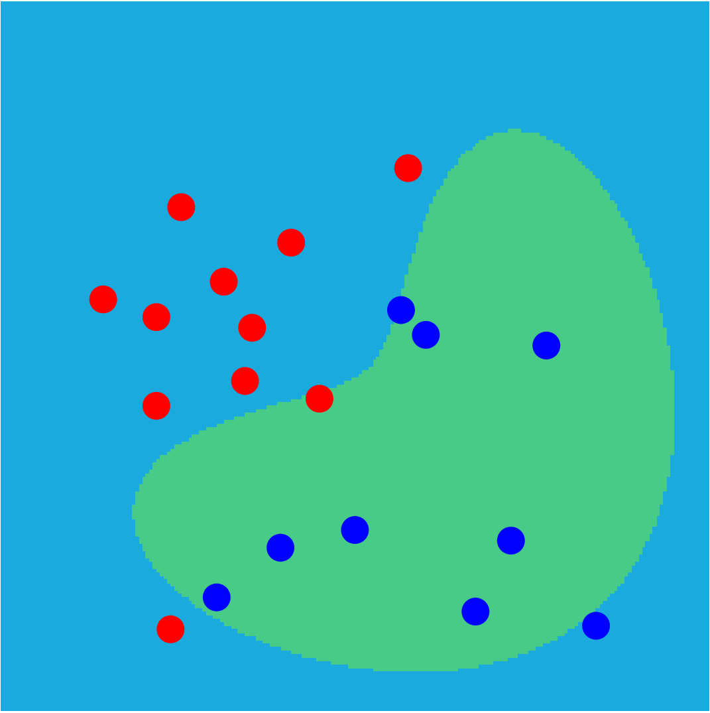

ML-MATLAB is a collection of MATLAB live scripts that illustrate concepts in
machine learning. They can be used in the classroom or for self-study.
These scripts have been used to teach the undergraduate course *Computational
Foundations of Machine Learning* at Georgia Institute of Technology.

Each script usually ends with a section called **Taking it further** which offers some
ideas for experimenting with the live script and learning more about the
concepts that are illustrated. If you are a student, we encourage you
to try out some of these ideas!

The goals behind these scripts are:

* Provide a way to understand statistics and machine learning concepts through
  seeing code (how equations translate into code) and also allow experimentation
  by modifying the data and algorithms.

* Show how easy it is to implement many machine learning algorithms directly in MATLAB,
  and provide a starting point for students' own implementations.

Since we primarily want to see the machine learning algorithms in their barest forms,
the scripts generally do not use the machine learning
tools built into MATLAB (an exception is the script for support vector machines).
However, some examples of MATLAB tools may be included in the future for those
who want to do more advanced prototyping of machine learning ideas in MATLAB.

Below, there are links to a web/html version of the live scripts, for your convenience.
If you want to experiment with the live scripts in MATLAB, download
the scripts via github, or open the script directly in MATLAB Online using the
buttons below.

The scripts are released with the MIT license. Feel free to modify and use
the scripts as you need, while retaining the MIT license. Feedback and
open-source contributions are welcome!

## Statistics Background

#### Solving linear least squares problems and linear regression

[least_squares.html](https://htmlpreview.github.io/?https://github.com/echow/ml-matlab/blob/main/live/least_squares.html) 

#### Estimating the variance of a distribution

[estimate_variance.html](https://htmlpreview.github.io/?https://github.com/echow/ml-matlab/blob/main/live/estimate_variance.html) 

#### Student's t-distribution

[t_distribution.html](https://htmlpreview.github.io/?https://github.com/echow/ml-matlab/blob/main/live/t_distribution.html) 

#### Chi-squared distribution

[chi2_distribution.html](https://htmlpreview.github.io/?https://github.com/echow/ml-matlab/blob/main/live/chi2_distribution.html) 

#### Distribution of the noise variance

[noise_variance_distribution.html](https://htmlpreview.github.io/?https://github.com/echow/ml-matlab/blob/main/live/noise_variance_distribution.html) 

## Overfitting and Regularization

#### Polynomial regression

[polynomial_regression.html](https://htmlpreview.github.io/?https://github.com/echow/ml-matlab/blob/main/live/polynomial_regression.html) 

#### Polynomial regression: bias and variance

[polyregr_bias_variance.html](https://htmlpreview.github.io/?https://github.com/echow/ml-matlab/blob/main/live/polyregr_bias_variance.html) 

#### Polynomial ridge regression

[polyregr_ridge.html](https://htmlpreview.github.io/?https://github.com/echow/ml-matlab/blob/main/live/polyregr_ridge.html) 

#### Why does L1 regularization (LASSO) tend to give sparse solutions?

[lasso_sparsity.html](https://htmlpreview.github.io/?https://github.com/echow/ml-matlab/blob/main/live/lasso_sparsity.html) 

#### Models that are a linear combination of basis functions

[lincombo_model.html](https://htmlpreview.github.io/?https://github.com/echow/ml-matlab/blob/main/live/lincombo_model.html) 

## Bayesian Inference

#### Bayesian inference for estimating the mean

[bayesian_inference.html](https://htmlpreview.github.io/?https://github.com/echow/ml-matlab/blob/main/live/bayesian_inference.html) 

#### Predictive distributions

[predictive_distribution.html](https://htmlpreview.github.io/?https://github.com/echow/ml-matlab/blob/main/live/predictive_distribution.html) 

#### Nonlinear models

[nonlinear_model.html](https://htmlpreview.github.io/?https://github.com/echow/ml-matlab/blob/main/live/nonlinear_model.html) 

#### Bayesian simulation

[bayesian_simulation.html](https://htmlpreview.github.io/?https://github.com/echow/ml-matlab/blob/main/live/bayesian_simulation.html) 

#### Markov chain Monte Carlo

[mcmc.html](https://htmlpreview.github.io/?https://github.com/echow/ml-matlab/blob/main/live/mcmc.html) 

#### Gaussian processes and Gaussian process regression

[gaussian_processes.html](https://htmlpreview.github.io/?https://github.com/echow/ml-matlab/blob/main/live/gaussian_processes.html) 

## Classification

#### Linear and quadratic discriminants

[discriminants.html](https://htmlpreview.github.io/?https://github.com/echow/ml-matlab/blob/main/live/discriminants.html) 

#### Logistic regression

[logistic_regression.html](https://htmlpreview.github.io/?https://github.com/echow/ml-matlab/blob/main/live/logistic_regression.html) 

#### Logistic regression with nonlinear basis functions

[logregr_basisfun.html](https://htmlpreview.github.io/?https://github.com/echow/ml-matlab/blob/main/live/logregr_basisfun.html) 

#### Support vector classifiers

[support_vector_classifiers.html](https://htmlpreview.github.io/?https://github.com/echow/ml-matlab/blob/main/live/support_vector_classifiers.html) 

#### Support vector machines

[support_vector_machines.html](https://htmlpreview.github.io/?https://github.com/echow/ml-matlab/blob/main/live/support_vector_machines.html) 

#### Neural networks

[neural_networks.html](https://htmlpreview.github.io/?https://github.com/echow/ml-matlab/blob/main/live/neural_networks.html) 

## Miscellaneous and Advanced Topics

#### Stochastic gradient descent

[stochastic_gradient_descent.html](https://htmlpreview.github.io/?https://github.com/echow/ml-matlab/blob/main/live/stochastic_gradient_descent.html) 

#### Nystrom low-rank approximation for kernel matrices

[nystrom.html](https://htmlpreview.github.io/?https://github.com/echow/ml-matlab/blob/main/live/nystrom.html) 
